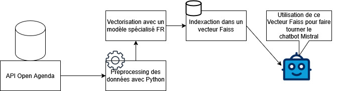
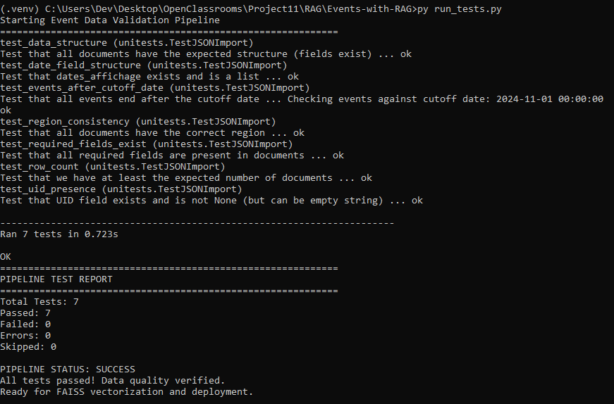
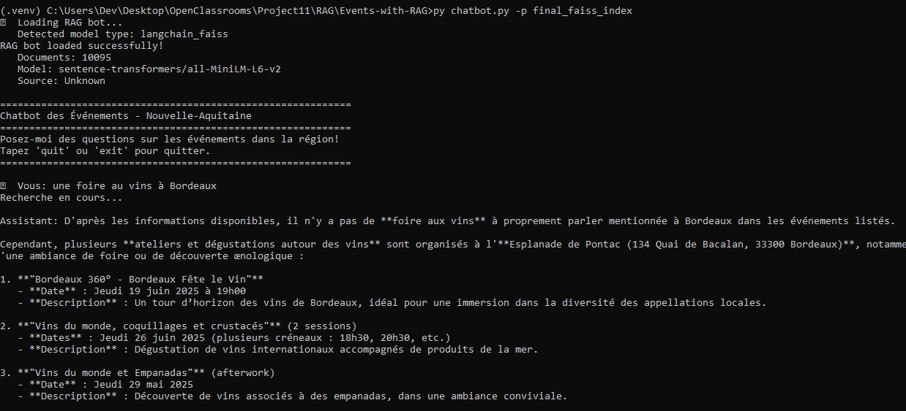

# Events-with-RAG

## De la donnée brute au chatbot



Pour lancer le venv et installer les packages necessaires :
```
python -m venv myvenv
.\.venv\Scripts\activate
pip install -r requirements.txt
```


## Importer les données d'Open Agenda
```
py data_importer.py --max-documents 1000 --data-path data
```
--max-documents', '-m'  : 'Maximum number of documents to fetch (default : 500)'  
--data-path', '-d'      : 'Path to exported data (default: data)'

### Avant de passer à la suite, validation des données
```
py run_tests.py
```




## Construire les vecteurs FAISS
```
py faiss_vectorizer.py -d data -s final_faiss_index --model "sentence-transformers/all-MiniLM-L6-v2"
```

--data-path', '-d'      : 'Path to imported data (default: data)'
--save-path', '-s'      : 'Path where to save the FAISS model (default: final_faiss_index)'  
--model', '-m'          : 'Embedding model to use (default: sentence-transformers/all-MiniLM-L6-v2)'

## Lancer le chatbot
```
py chatbot.py -p final_faiss_index
```
--query', '-q', type=str,                                   : 'Run a single query instead of interactive mode'
--faiss-path', '-p', default='final_faiss_index',           : 'Path where to load the FAISS model (default: final_faiss_index)'  
--list-models', '-l', action='store_true'                   : 'List available models and exit'

/!\ Une clé CHAT_MISTRAL_AI_KEY est necessaire pour utiliser leur modèle gratuit, cette clé est lue dans un secrets.json placé dans le dossier root et se présentant ainsi :
```
{
    "CHAT_MISTRAL_AI_KEY": "zzzzzzzzzzzzzzzzzzzzzzzzzzzzzzzzzz"
}
```


